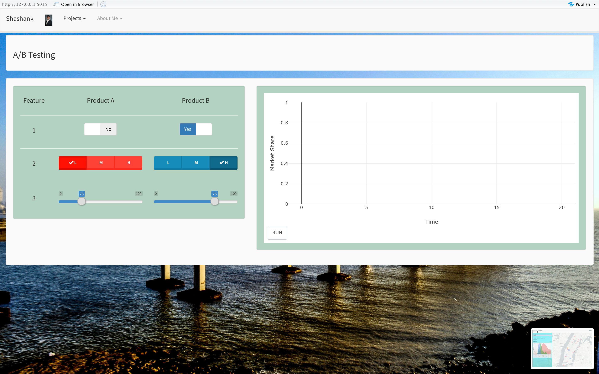
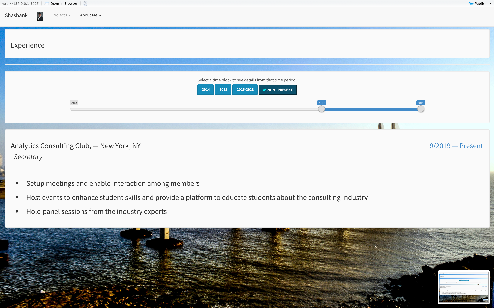
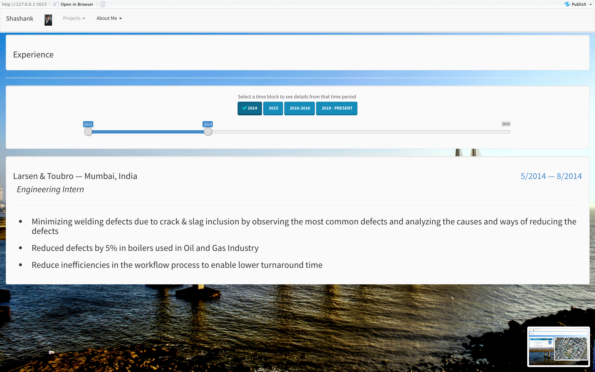

# Shiny-Resume-app
An interactive app made on R Shiny which displays all my projects and my resume
The project is made in R language which showcases my projects on a Shiny app. The app can be divided into three sections. 
The first section displays the projects of Airbnb, Sampling, A&B testing and a visualization of all the baseball teams. 

Home Page: 

The second section displays my resume and experience in a chronological order

The third section displays useful links to connect with me

